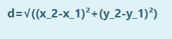
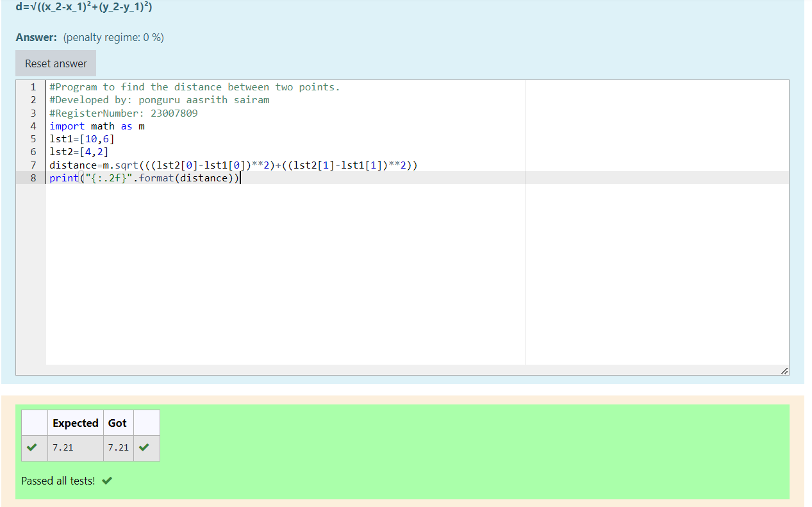

# DISTANCE-BETWEEN-TWO-POINTS

## AIM:
To write a python program to find the distance between two 2 points
## ALGORITHM:
### Step 1: import math module using 'import math' statement
### Step 2: substitute x1 and y1 values in a list
### Step 3: substitute x2 and y2 values in another list
### Step 4: Substitute the values in the distance formula and assign the distance value to a variable after using math module's square root function to find the distance 
### Step 5: print the distance and round off to 2 decimal points using '{'2f}.'
### PROGRAM:
```
#Program to find the distance between two points.
#Developed by: ponguru aasrith sairam
#RegisterNumber: 23007809
import math as m
lst1=[10,6]
lst2=[4,2]
distance=m.sqrt(((lst2[0]-lst1[0])**2)+((lst2[1]-lst1[1])**2))
print("{:.2f}".format(distance))
 ``` 


### OUTPUT:



### RESULT:
Thus distance between 2 points is obtained
